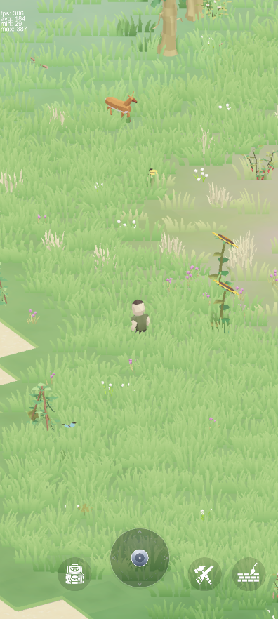

> **Source-available, not open source.** This is a read-only mirror of the code of a private
> Unity project. Third-party assets, art and game data are not included, so the project does
> not build from this repository. See [LICENSE](LICENSE).

# Hearthglade

**A cozy-but-unforgiving survival game for mobile, built in Unity.**
Wake up on a procedurally generated island, gather what the land gives you, craft your tools, build a shelter, grow a garden, and cook a decent meal. Then sail out to discover new islands, harbours and traders.

## Features

<table>
  <tr>
    <td width="300" valign="top">
      
    </td>
    <td valign="top">
      <ul>
        <li><b>Procedural worlds</b>: every island is generated from deterministic, seeded noise (height, temperature, humidity) and mapped to biomes, resources, creatures and points of interest. A new world type is just a new combination of data assets, with no new code.<br><br></li>
        <li><b>Survive and craft</b>: gather resources, craft tools and equipment, and keep an eye on food and the day/night cycle.<br><br></li>
        <li><b>Build a shelter</b>: place buildings and furniture in the world.<br><br></li>
        <li><b>Farming and cooking</b>: plant crops that keep growing while you are away, defend the garden from raiding animals, and cook dishes at tiered stations (fireplace, pot) whose quality depends on the ingredients.<br><br></li>
        <li><b>Exploration loop</b>: sail to new islands, discover ports, barter with traders, fulfil contracts, and spend expedition points on ship upgrades.<br><br></li>
        <li><b>Modular characters</b>: one shared Humanoid skeleton with swappable head, torso and shoes, colour roles, gestures and a small NPC brain.<br><br></li>
        <li><b>Built for mobile</b>: touch controls, Addressables-based content loading, Google Play Games integration.<br><br></li>
      </ul>
    </td>
  </tr>
</table>

## Under the hood

The project is split into a **Unity-free core** and a thin Unity layer on top of it:

| Layer | What lives there |
|-------|------------------|
| `Gameplay/Core` | Pure C# game logic (world generation, farming model, trade, expeditions). No `UnityEngine` references, so it is fast to test with plain `dotnet test`. |
| Unity layer | MonoBehaviours, views, UI and services that read the core's results and turn them into GameObjects. |
| Data | ScriptableObjects for maps, biomes, crops, items, ports and recipes, so content is added in the editor, not in code. |

Highlights:

- **Dependency injection** with VContainer.
- **Async-first** flow with UniTask, with heavy world generation run on a thread-pool worker.
- **Deterministic simulation**: crop growth and world generation are pure functions of seed and time, so chunks can unload at any moment without losing anything.
- **Custom editor tooling**: an in-scene point-of-interest layout editor, a cooking recipe editor, and dev tools for batch screenshots of generated content.
- **Tests**: NUnit unit tests for the core and PlayMode integration tests for gameplay systems.
- **Design docs** in [`docs/`](docs): reference documents for the world generation and farming systems.

## Tech stack

| | |
|---|---|
| Engine | Unity 6 (`6000.6`), URP |
| Language | C# |
| Architecture | VContainer (DI), UniTask (async), ScriptableObject data |
| Content | Addressables, Blender-authored low-poly models |
| Testing | NUnit (EditMode and PlayMode) |

## Project structure

```
Assets/
  Scripts/Gameplay/   Game code (Core logic, Map, Items, Player, UI, ...)
  Scripts/Editor/     Editor tools
  Scripts/Tests/      Unit and PlayMode tests
  ScriptableObjects/  Game data
  Scenes/             Scenes
Tools/                Blender and Unity helper scripts
docs/                 Design docs and system references
```

## Status

Hearthglade is a work in progress and a solo project. The exploration loop (ships, ports, trading, contracts) is the current focus.
